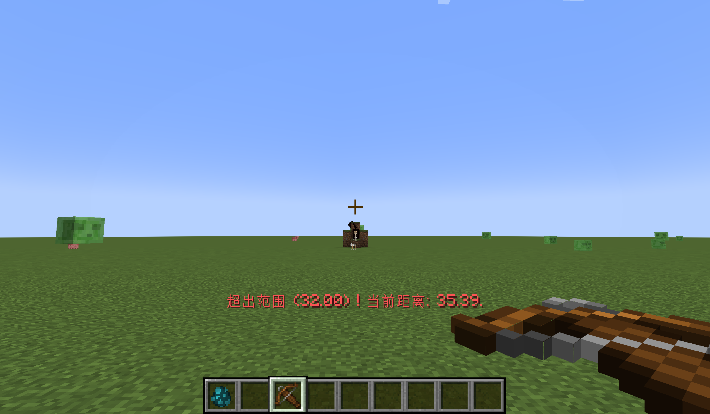

# Social Distance

## 🪄Introduction

This mod is mainly made for modpacks, preventing players from easily killing bosses from afar.

## ⚙️Configuration

### The initial configuration file looks like:

```
{
  "show_message": true,
  "message_overlay": true,
  "distance_config": {
    "minecraft:wither": 32.0,
    "minecraft:warden": 32.0
  }
}
```
To add the boss to the protection list, just simply add an entry to the "distance_config" property.

The key of the entry represents the identifier (namespace:path) of the entity.

The value represents the "social distance" (float), within which players can attack the target.



## ✉️Feedback

If there are any bugs or suggestions, please provide feedback to the issue page.
